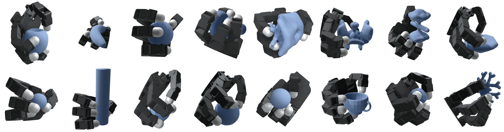
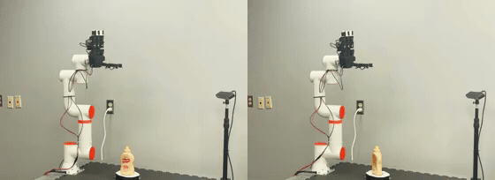
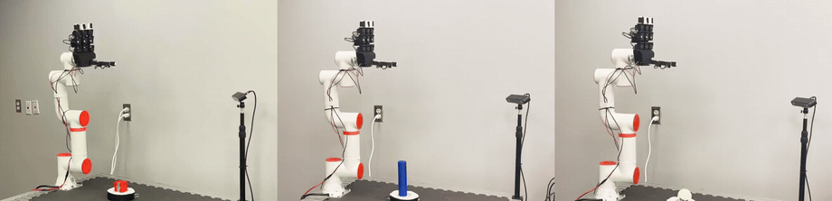
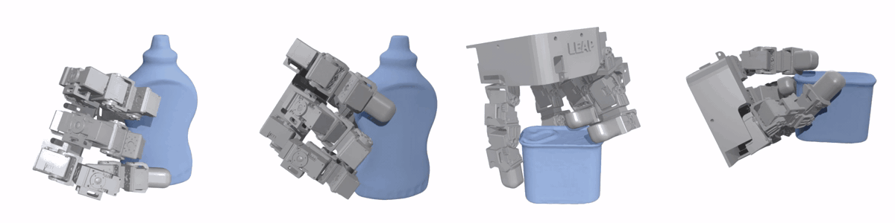

<div align="center">


# EquiDexFlow

**SE(3)-Equivariant 6-DoF Dexterous Grasp Generative Flows**

[Project Page](https://equidexflow.github.io) &nbsp;·&nbsp;
[Paper (arXiv)](http://arxiv.org/abs/2606.12728) &nbsp;·&nbsp;
[Data](#pretrained-checkpoints--datasets) &nbsp;·&nbsp;
License: MIT &nbsp;·&nbsp;
Python ≥ 3.10 &nbsp;·&nbsp;
PyTorch ≥ 2.0



</div>

EquiDexFlow takes an object point cloud and a kinematic model of a $D$-DoF, $M$-fingered robotic hand and produces, in a single forward pass: a wrist SE(3) pose, $D$ joint angles from a conditional normalizing
flow, a set of $M$ contact points projected onto the object surface, and
per-contact forces projected into the friction cone, all jointly consistent
with the learned distribution. The released Allegro checkpoints use
$D{=}16$ and $M{=}4$. Both are set per-hand in the model config.

---

## Quickstart

Drop the repo into an isolated Python environment first (venv or conda — pick one):

```bash
# Option A: venv (stdlib)
python3.10 -m venv .venv && source .venv/bin/activate
pip install --upgrade pip

# Option B: conda / mamba
conda create -n equidexflow python=3.10 -y && conda activate equidexflow
```

Getting from a fresh checkout to a posed-hand grasp preview PNG is easy with the bundled code. You can do it in three lines:
```bash
pip install -e ".[demo]"
python checkpoints/download_checkpoints.py allegro_full
equidexflow-demo --mesh assets/objects/graspit/sphere.stl --checkpoint allegro_full
# -> out/demo/preview.png,  out/demo/grasp_{00..07}.npz
```

Or call the model directly from Python (pure inference):

```python
import torch, trimesh
from equidexflow import load_checkpoint

mesh = trimesh.load("assets/objects/graspit/sphere.stl", force="mesh")
pts, _ = trimesh.sample.sample_surface(mesh, 512)
pc    = torch.from_numpy(pts.T).float().cuda()           # (3, N)

model  = load_checkpoint("allegro_full", device="cuda")
grasps = model.sample(pc, num_samples=10)                # list[dict] of length 10

g = grasps[0]
g["wrist_pose"]    # (4, 4)  SE(3) wrist pose
g["hand_q"]        # (16,)   joint angles
g["contacts"]      # (M, 3)  surface-projected fingertip contacts; one contact per finger => M = 4 (LEAP, Allegro)
g["forces"]        # (M, 3)  friction-cone-projected contact forces
g["contact_logits"]# (M,)    per-finger confidence
```

## Installation

Tested on Linux, Python 3.10–3.12, PyTorch 2.0+, CUDA 11.8+ (CUDA is auto-detected, but CPU also
works for inference, only that it runs slowly once the ODE solver hits full sample counts). There are three installation flavors: `default`, `demo` (recommended), and `all`. For the full set of
extras (`data`, `train`, `viz`, `demo`), see the project's [`pyproject.toml`](pyproject.toml).

```bash
pip install -e .              # pure inference (torch, numpy, scipy, omegaconf, roma)
pip install -e ".[demo]"      # above  + trimesh / open3d / matplotlib / gdown (recommended)
pip install -e ".[all]"       # [demo] + training / dataset loaders / plotting

equidexflow-info              # quick sanity test: print version, CUDA, present checkpoints
```

## Pretrained Checkpoints & Datasets

> [!NOTE]
> The checkpoints we release are for the **Allegro Hand**. **We already trained and evaluated EquiDexFlow on the LEAP Hand asuccessfully, but thumb abduction quality on the decoded LEAP Hand grasps isn't where we'd like it to be and not on par with the Allegro Hand, so we are currently investigating GT synthesis/TTO refinements to improve thumb abduction. As a result, the LEAP Hand checkpoints are not included in our v0.1.0 release, but we hope to release them soon once the above issue is solved.** We produced the hardware results below by retargeting Allegro grasps to the LEAP Hand via inverse kinematics.

We release both Allegro checkpoints and test-split grasp dataset (811 grasps per hand) on Google Drive, pinned by sha256 in [`checkpoints/MANIFEST.yaml`](checkpoints/MANIFEST.yaml). Re-downloading leaves any file already on disk with the right hash untouched. Download them using the following commands:

```bash
# 5 model variants (allegro_full + 3 ablations + 1 alt flow), ~5 .pt files
python checkpoints/download_checkpoints.py --all

# 2 test-split tarballs (811 grasps per hand) -> data/dexgraspdb/v3/<hand>/
python scripts/download_assets.py --all
```

The dataset we release is the **10% test split** (811 grasps per hand) behind
the paper's results table. We generated the other 90% (train and validation)
with an internal synthesis pipeline that we do not release. The published
checkpoints are what that run produced. We bundle a few object meshes under
`assets/objects/`, enough for the demo CLI and the quickstart. Evaluating
against the full test split also needs the original YCB, EGAD, and GraspIt
meshes on disk, so point `EQUIDEXFLOW_OBJECTS_DIR` at them:

```bash
export EQUIDEXFLOW_OBJECTS_DIR=/path/to/objects
```

## Demo and Visualization

`equidexflow-demo` is the demo entry point: mostly-watertight mesh in, grasps and preview out.

```bash
# Default: 8 grasps, headless 2-pane preview PNG
equidexflow-demo --mesh assets/objects/frogger_ycb/006_mustard_bottle.obj \
                 --checkpoint allegro_full --num-samples 8 --out out/mustard

# Interactive viewer (Open3D): object mesh + hand collision spheres + contacts
equidexflow-demo --mesh assets/objects/graspit/cylinder.stl --viz
```

Each run writes one `preview.png` plus a `grasp_NN.npz` per sample containing
the wrist pose, joint angles, contacts, forces, contact logits, and the
forward-kinematics-evaluated hand sphere positions. Decoding is one line:

```python
import numpy as np
g = np.load("out/demo/grasp_00.npz")
g.files  # ['wrist_pose', 'hand_q', 'contacts', 'forces', 'contact_logits',
         #  'hand_sphere_xyz', 'hand_sphere_radii']
```

## Hardware & Simulation Results

### Hardware Execution
We retarget the Allegro grasps from this codebase to a physical [LEAP Hand](https://leaphand.com/) on a 6-DoF
[FAIR Innovation FR3 cobot (ZArm 622)](https://www.frtech.fr/FR/5.html) via inverse kinematics, then run them across several objects. We do not perform re-planning for the rotated case. Under equivariance, each grasp rotates together with the object, and the same grasp was reachable and executable in both the 0&deg; and 120&deg; configurations. In practice, however, the wrist poses associated with some grasps in the 120&deg; configuration admitted inverse-kinematics solutions with higher Yoshikawa manipulability indices than the grasp selected from the 0&deg; seed configuration, leading those grasps to be chosen at execution time.


<p align="center">
  
  <br/>
  <sub><b>Top row:</b> box primitive at 0&deg; / 120&deg;. &nbsp; <b>Bottom row:</b> potted-meat can at 0&deg; / 120&deg;.</sub>
</p>

The YCB mustard bottle, also under the 0&deg; $\rightarrow$ 120&deg; co-rotation:

<p align="center">
  
  <br/>
  <sub>Left: 0&deg;. &nbsp; Right: 120&deg;.</sub>
</p>

More objects, a cube primitive plus two rotation-symmetric objects:

<p align="center">
  
  <br/>
  <sub>Left to right: cube primitive, cylinder primitive, tennis ball.</sub>
</p>

### Simulation: Shake-Test Robustness
We also stress-test the decoded grasps in [Drake](https://drake.mit.edu/) with
the [GenDexGrasp](https://github.com/tengyu-liu/GenDexGrasp)/[GAGrasp](https://arxiv.org/abs/2503.04123) force-perturbation-based shake protocol: gravity off, a ±*xyz* inertial load on
the object along all six axes. A grasp passes if the object drifts under 2 cm in
every direction. Both objects pass at the canonical pose and its 120&deg;
co-rotation, and the held object barely moves.

<p align="center">
  
  <br/>
  <sub>Left to right: mustard bottle (0&deg;, 3.2&nbsp;mm max drift), mustard bottle (120&deg;, 3.4&nbsp;mm), potted-meat can (0&deg;, 0.9&nbsp;mm), potted-meat can (120&deg;, 9.2&nbsp;mm), all pass (&lt; 2&nbsp;cm).</sub>
</p>

The [project page](https://equidexflow.github.io) has higher-resolution clips
and the full set. We do not release the retargeting and controller stack or the
Drake harness, since both are platform-specific. What ships here is the model
that generated the grasps in these clips.

## Reproducing the Paper's Results
This release reproduces the **model-side** numbers in the paper: the
grasp-quality table over the four ablations on the 81-object test split,
the per-metric contact / force / rollout / equivariance / diversity
breakdowns, and the inference-time ablations.

One command after `download_checkpoints` and `download_assets`:

```bash
./scripts/reproduce.sh                 # CPU/GPU autodetect
./scripts/reproduce.sh --device 0      # pin a GPU
```

For per-metric breakdowns and individual evaluation commands, see
[**REPRODUCE.md**](REPRODUCE.md). Caveat: `model.sample()` is stochastic
and the eval sets no seed by default. REPRODUCE.md documents the expected
spread on composite scores.

The paper's physics validation and hardware numbers come from these same
checkpoints, but the simulators and controller behind them sit outside this
release (see above).

## Bring Your Own Data

We use FRoGGeR as the default emitter behind the checkpoints released here.
EquiDexFlow's trainer, however, is not tied to any synthesis backbone. The
training script we supply reads a documented JSON grasp schema, so any dataset
can train EquiDexFlow, provided it follows that schema. A minimal per-grasp
record:

```json
{
  "contact_points_mm": [[x, y, z], ...],     // (M, 3) mm, object frame
  "contact_normals":   [[nx, ny, nz], ...],  // (M, 3) unit, inward
  "hand_dof_values":   [q0, ..., q15],       // (D,) radians, Drake joint order
  "epsilon_quality":   0.012,                // force-closure metric (scalar)
  "volume_quality":    1.5e-5                // wrench-cone volume (scalar)
}
```

You write one such file per object under
`$EQUIDEXFLOW_DATA_DIR/dexgraspdb/v3/<hand>/<object>.json`. We compute the
contact forces at load time from the contacts, normals, friction `mu`, and
object mass, so you never store them. Add `wrist_pose_object`,
`contact_finger_ids`, and an object mesh to sharpen the grasps. The block above
is the floor. [`data/README.md`](data/README.md) covers the rest: the
frame-centering convention (you do not pre-center) and how we resolve mesh
stems.

To train, point the loader at your files and run:

```bash
export EQUIDEXFLOW_DATA_DIR=/path/to/datasets     # holds dexgraspdb/v3/<hand>/*.json
export EQUIDEXFLOW_OBJECTS_DIR=/path/to/objects   # meshes for point-cloud sampling
python scripts/train.py --config src/equidexflow/configs/equidexflow_dex_full.yml
```

The config's `data:` block sets `grasp_db_dir` (your `<hand>`), `mu`, object
mass, point count, the split (`pre_split: true` for already-split data), and
the object subset.

We ship no format converter, so you emit the schema yourself. Match the record
shown above and the loader will train on data from any backbone.

## Repo Layout
```
equidexflow/
├── src/equidexflow/        # model + API (pure torch/numpy/scipy)
│   ├── api.py              # load_checkpoint(...)
│   ├── models/             # equi_dex_flow + VN-DGCNN + decoders
│   ├── kinematics/         # Allegro / LEAP FK (differentiable)
│   ├── losses/  trainers/  metrics/  loaders/  physics/
│   └── cli/                # equidexflow-demo, equidexflow-info
├── scripts/                # train.py, run_full_eval.py, eval_*, plot/, reproduce.sh
├── checkpoints/            # MANIFEST.yaml and downloader. <variant>/{best.pt, config.yml}
├── data/dexgraspdb/v3/     # downloaded test-split tarballs (see data/README.md for the schema)
├── assets/                 # hand URDFs + mesh primitives + logo + teaser media
└── tests/                  # pytest
```

## Citation
If you find EquiDexFlow (either the code, dataset, or the paper) useful in your work, please cite us using the following BiBTeX entry:

```bibtex
@article{enwerem_equidexflow_2026,
  author = {Enwerem, Clinton and Baras, John S. and Belta, Calin},
  title  = {{EquiDexFlow}: Contact-Grounded {SE}(3)-Equivariant Dexterous Grasp Generative Flows},
  year   = {2026},
  doi = {10.48550/arXiv.2606.12728},
  number = {{arXiv}:2606.12728},
  publisher = {{arXiv}},
  date = {2026-06-10},
  eprinttype = {arxiv},
  eprint = {2606.12728 [cs.RO]},
  shorttitle = {{EquiDexFlow}},
  url = {http://arxiv.org/abs/2606.12728}
}
```

## Acknowledgments

This codebase is a Coulomb-compliant, contact-geometry-aware dexterous extension of
[**EquiGraspFlow**](https://github.com/bdlim99/EquiGraspFlow)
([Lim et al., CoRL 2024](https://proceedings.mlr.press/v270/lim25a.html)),
used under the MIT License. The SE(3)-equivariant flow-matching backbone,
VN-DGCNN encoder, Lie-group utilities, ODE solvers, and SE(3) base
distributions originate upstream. See [`NOTICE`](NOTICE) for a per-file
breakdown. The encoders build on
[Vector Neurons (Deng et al., 2021)](https://arxiv.org/abs/2104.12229)
and [DGCNN (Wang et al., 2019)](https://arxiv.org/abs/1801.07829). The simulation shake test was adapted to Drake from the works of the GenDexGrasp ([paper](https://arxiv.org/abs/2210.00722), [code](https://github.com/tengyu-liu/GenDexGrasp)) and GAGrasp ([paper](https://arxiv.org/abs/2503.04123)) authors. We synthesized training grasps with
[FRoGGeR](https://github.com/alberthli/frogger) introduced in [Li et al., IROS 2023](https://arxiv.org/abs/2302.13687)
and ran the hardware results on the
[LEAP Hand (Shaw et al., RSS 2023)](https://leaphand.com).
We gratefully acknowledge the authors of the aforementioned papers and their associated repositories. We also thank the maintainers of PyTorch, Open3D, trimesh, and Drake.